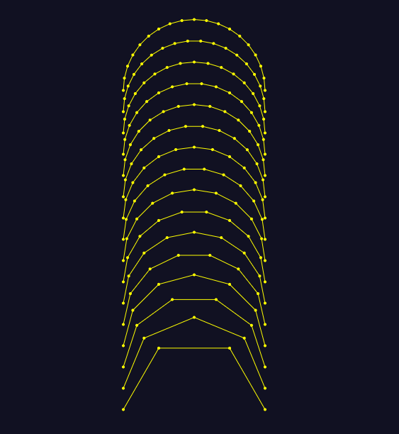

# subdivide-arc

subdivide an arc into line segments




## install

```npm install subdivide-arc```

## use

with node and browserify

```javascript

var sa = require('subdivide-arc')

// draw a circle with 100 divisions (aka 1 point every 3.6 degrees)
var points =  sa(0, 0, 10, 0, Math.PI*2, 100)
[ [ 10, 0 ],
  [ 9.979866764718844, 0.6342391965656451 ],
  [ 9.919548128307953, 1.2659245357374929 ],
...

```

## api surface

`var array = sa(centerX, centerY, radius, startAngle, endAngle, subdivisions, invertDirection)`

## license

[MIT](LICENSE.txt)


